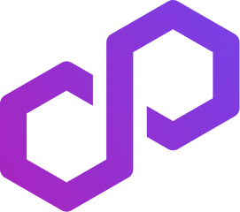

<h1>Polygon Gaming Receipes</h1>
 

- [Introduction](#introduction)
- [Types of recipes](#types-of-recipes)
  - [Tools](#tools)
  - [Game Services Infrastructure](#game-services-infrastructure)
  - [Smart Contracts/Token Standards:](#smart-contractstoken-standards)
- [Contributing](#contributing)
  - [Submission guidelines](#submission-guidelines)
    - [Compatibility](#compatibility)
    - [Documentation](#documentation)
    - [Testing](#testing)
    - [Security](#security)
    - [Accessibility](#accessibility)
    - [Code review process](#code-review-process)
    - [Community involvement](#community-involvement)
  - [Adding recipes](#adding-recipes)
- [License](#license)
<!-- /TOC -->
---

## Introduction

The Polygon gaming use case framework is a repository of reference implementations and tools for building decentralized games and gaming infrastructure on the Polygon network, as well as any applicable protocol, solution, or tooling. This framework aims to create a flourishing resource hub of gaming recipes and templates driven by the community. By providing a platform for developers, designers, and other stakeholders to contribute their ideas and expertise, we aim to create a comprehensive set of high-quality, well-documented, accessible tools and resources for building innovative and engaging games on the Polygon ecosystem.

We aim to foster a collaborative community that is passionate about gaming and blockchain technology and works together to create a thriving ecosystem of games and gaming infrastructure on Polygon and beyond. To achieve this goal, we rely on the contributions of the community. By contributing to this framework, you can help to advance decentralized gaming and help to make Polygon and the broader ecosystem a more vibrant and exciting platform for gaming.

This document outlines the guidelines for contributing to the Polygon gaming use case framework. By following these guidelines, you can ensure that your contributions are of the highest quality and meet the community's needs. We look forward to your contributions and thank you for supporting decentralized gaming on Polygon and beyond.

## Types of recipes

### Tools

- **dApps**: Recipes in this category will guide how to build and deploy decentralized applications (dApps) that utilize the Polygon network. This may include tutorials on integrating the Polygon SDK into your dApp, using Polygon's web3 API, or deploying smart contracts to the Polygon network.

- **Blockchain infrastructure**: Recipes in this category will guide how to set up and manage the blockchain infrastructure needed to create decentralized games on Polygon. This may include tutorials on running a node on the Polygon network, deploying and executing smart contracts, or using Polygon's Layer 2 scaling solutions.
- Wallets: Recipes in this category will provide guidance on how to build and use wallets that support Polygon. This may include tutorials on integrating the Polygon network into existing wallets or building new wallets that support Polygon.

- **Marketplaces**: Recipes in this category will guide how to build and use marketplaces that support Polygon. This may include tutorials on integrating the Polygon network into existing marketplaces or building new marketplaces that support Polygon.

- **Relayers**: Recipes in this category will guide building and using relayers that support Polygon. This may include tutorials on integrating the Polygon network into existing relayers or building new relayers that support Polygon.

- **Indexers**: Recipes in this category will guide how to build and use indexers that support Polygon. This may include tutorials on integrating the Polygon network into existing indexers or building new indexers that support Polygon.

### Game Services Infrastructure

- **Content management**: Recipes in this category will guide how to manage content for decentralized games on Polygon. This may include tutorials on storing and managing game assets on IPFS, using decentralized content delivery networks (CDNs), or setting up metadata services for games on Polygon.

- **Fiat/KYC**: Recipes in this category will guide integrating fiat currency and KYC (know your customer) verification into decentralized games on Polygon. This may include tutorials on using third-party services for fiat on-ramps and off-ramps or how to build your fiat/KYC solution.

- **Games backends**: Recipes in this category will guide how to build and manage the backend infrastructure for decentralized games on Polygon. This may include tutorials on using database solutions for games, building game logic on Polygon's Layer 2 scaling solutions or using decentralized messaging protocols for multiplayer games.

### Smart Contracts/Token Standards:

- **Smart Contracts**: Recipes in this category will guide how to create and deploy smart contracts on the Polygon network. This may include tutorials on using the Solidity programming language to create smart contracts, testing and deploying smart contracts on the Polygon network, or using popular smart contract frameworks like OpenZeppelin on Polygon.

- **Token Standards**: Recipes in this category will guide creating and using token standards on the Polygon network. This may include tutorials on how to use popular token standards like ERC-20 or ERC-721 on Polygon or how to create new token standards for specific gaming use cases.

## Contributing

We welcome contributions from developers, designers, and other stakeholders who are passionate about gaming and blockchain technology.

Please keep the [Style Guide](STYLE_GUIDE.md) and [Code of Conduct](CODE_OF_CONDUCT.md) in mind.

To contribute to the Polygon gaming recipes, please follow these guidelines:

### Submission guidelines

Create a detailed recipe, tutorial, or general resource that showcases a common component or template for a gaming use case on the Polygon ecosystem. Your contribution should be original, informative, and technically accurate. It should be written in clear and concise language, with step-by-step instructions, screenshots, or other visual aids where necessary. It should include any code snippets or configuration files to implement the component or template. Your contribution should be submitted in a standard format.

#### Compatibility

Your contribution should be compatible with the Polygon ecosystem and any applicable protocol, solution, or tooling. It should be built upon Polygon PoS or Mumbai testnet and be stable or progressing towards stability.

#### Documentation

Your contribution should be thoroughly documented, including clear explanations of using and customizing the component or template, any dependencies or prerequisites, and any relevant technical details. You should include code coverage/audit/oss guidelines as applicable.

#### Testing

Your contribution should be thoroughly tested to ensure it meets the required standards for quality and functionality. Consider including testing and quality assurance guidelines, such as code coverage and integration testing.

#### Security

Since the contributions involve blockchain infrastructure, it's essential to consider security implications. Consider adding guidelines for security best practices, such as secure coding standards and vulnerability assessments.

#### Accessibility

Consider adding guidelines for accessibility best practices to ensure that the contributions are accessible to a wide range of users.

#### Code review process

A team of experts will review your contribution to ensure accuracy, completeness, and adherence to the guidelines. Contributors may be asked to revise their submissions based on feedback from the review team.

#### Community involvement

We encourage contributors to share their ideas and collaborate with other community members. Join our Discord channel to connect with other developers and share your ideas.

### Adding recipes

To add your contribution to the repository, please follow these steps:

1. Fork the repository at https://github.com/PolygonStudiosLab/gaming-recipes.

2. Create a new file or folder in one of the sub-directories in the "recipes" directory. The "recipes" directory contains sub-directories for "templates", "components", "tools," and so on, so please make sure to add your contribution to the appropriate sub-directory.

3. Ensure that there is a README file that describes the content of your contribution, including any relevant technical details, dependencies, and usage instructions.

4. Follow the guidelines this document outlines to ensure that your contribution meets the required standards for quality, functionality, and compatibility with the Polygon ecosystem.

5. Once you have completed your contribution, submit a pull request to the repository. Your contribution will be reviewed by one of the maintainers of this repository to ensure accuracy, completeness, and adherence to the guidelines.

> Please note that as a contributor, you may have expertise in specific domains and gaming logic, and we encourage you to share your insights, collaborate with other community members, and act as a subject matter expert for particular contributions.

As the repository grows, we plan to create a table to organize all of the recipes in a more accessible and user-friendly manner. The table will categorize the recipes based on common use cases and gaming logic, making it easy for developers to find the necessary tools and resources.

## License

[MIT License](LICENSE) © Polygon Labs
